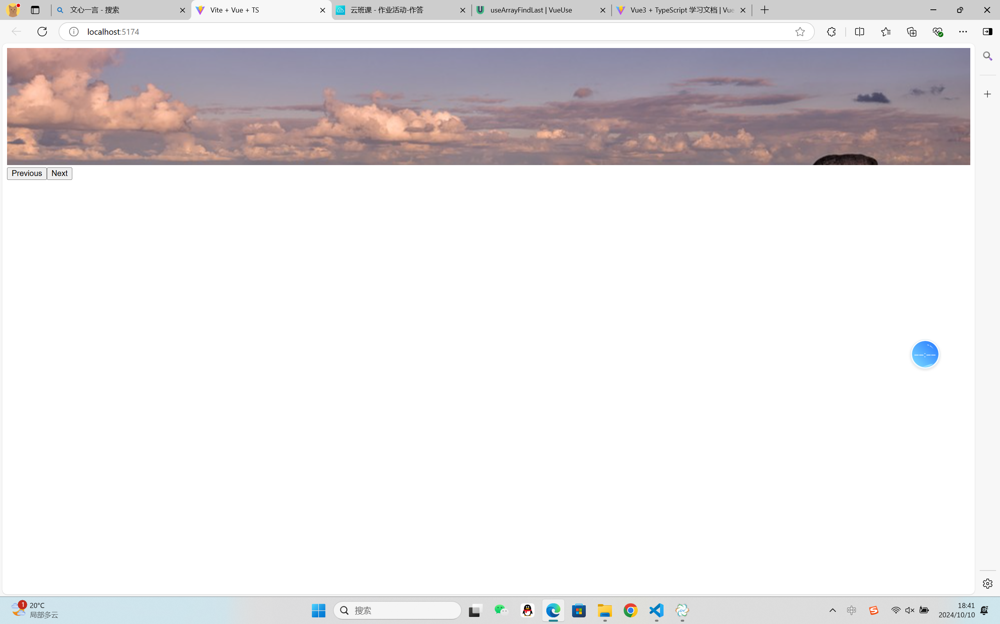
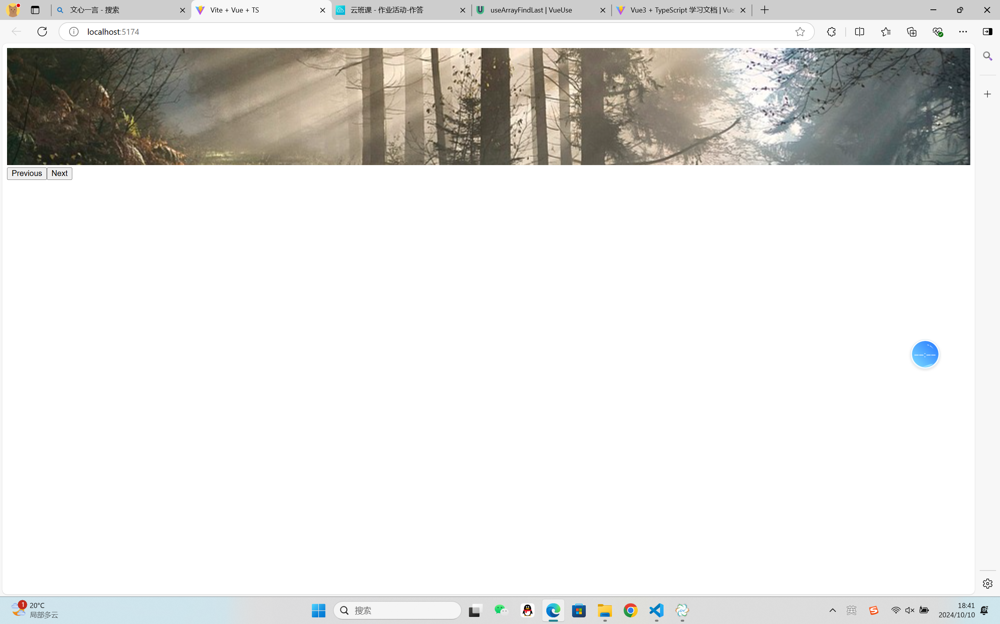

## 使用循环列表

反应性的使用循环列表

### 演示




### 用法

```javascript
import { useArrayFindLast } from "@vueuse/core";

const list = [ref(1), ref(-1), ref(2)];
const positive = useArrayFindLast(list, (val) => val > 0);
// positive.value: 2
```

###组件使用

```javascript
import { useArrayFindLast } from "@vueuse/core";

const list = reactive([-1, -2]);
const positive = useArrayFindLast(list, (val) => val > 0);
// positive.value: undefined
list.push(10);
// positive.value: 10
list.push(5);
// positive.value: 5
```

### 类型声明

```javascript
/**
 * Reactive `Array.findLast`
 *
 * @see https://vueuse.org/useArrayFindLast
 * @param list - the array was called upon.
 * @param fn - a function to test each element.
 *
 * @returns the last element in the array that satisfies the provided testing function. Otherwise, undefined is returned.
 */
export declare function useArrayFindLast<T>(
  list: MaybeRefOrGetter<MaybeRefOrGetter<T>[]>,
  fn: (element: T, index: number, array: MaybeRefOrGetter<T>[]) => boolean,
): ComputedRef<T | undefined>
```

### 项目代码

Pickut.vue

```javascript
<script setup lang="ts">
import { computed } from "vue";
import { useCycleList } from "@vueuse/core";

const { state, next, prev } = useCycleList([
  "https://tinyurl.com/2p8dav94",
  "https://tinyurl.com/2p9yrrhs",
  "https://tinyurl.com/ycxurpah",
]);
</script>

<template>
  <div class="carousel">
    <transition>
      
    </transition>
  </div>

  <button @click="prev()">Previous</button>
  <button @click="next()">Next</button>
</template>

<style>
.carousel {
  position: relative;
  height: 200px;
}
img {
  width: 100%;
  position: absolute;
  height: 200px;
  object-fit: cover;
}
.v-enter-active,
.v-leave-active {
  transition: all 0.2s ease;
}
.v-enter-from,
.v-leave-to {
  opacity: 0;
}
</style>
```
