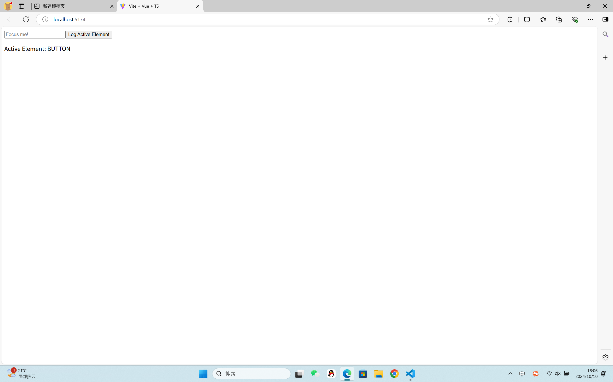
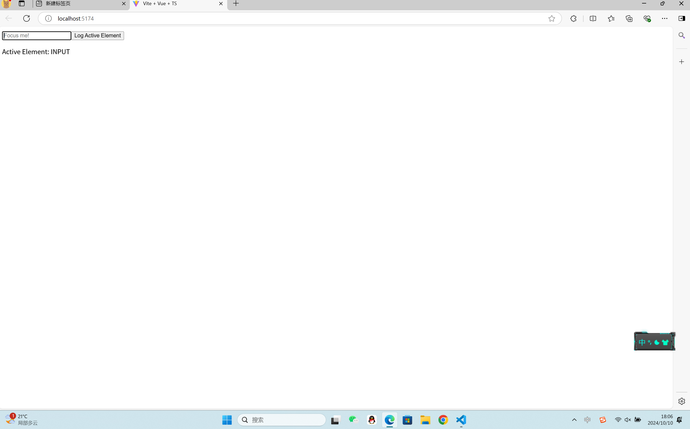

## useActionElement

反应性的document.activeElement

### 演示




### 用法

```javascript
import { useActiveElement } from "@vueuse/core";

const activeElement = useActiveElement();

watch(activeElement, (el) => {
  console.log("focus changed to", el);
});
```

###组件使用

```javascript
<template>
  <UseActiveElement v-slot="{ element }">
    Active element is {{ element.dataset.id }}
  </UseActiveElement>
</template>
```

### 类型声明

```javascript
export interface UseActiveElementOptions
  extends ConfigurableWindow,
    ConfigurableDocumentOrShadowRoot {
  /**
   * Search active element deeply inside shadow dom
   *
   * @default true
   */
  deep?: boolean
  /**
   * Track active element when it's removed from the DOM
   * Using a MutationObserver under the hood
   * @default false
   */
  triggerOnRemoval?: boolean
}
/**
 * Reactive `document.activeElement`
 *
 * @see https://vueuse.org/useActiveElement
 * @param options
 */
export declare function useActiveElement<T extends HTMLElement>(
  options?: UseActiveElementOptions,
): Ref<T | null | undefined, T | null | undefined>
```

### 项目代码

MyComponent.vue

```javascript
<template>
  <div>
    <input type="text" placeholder="Focus me!" />
    <button @click="logActiveElement">Log Active Element</button>
    <p v-if="activeElement">Active Element: {{ activeElement?.tagName }}</p>
  </div>
</template>

<script setup lang="ts">
import { useActiveElement } from "../composables/useActiveElement";

const { activeElement } = useActiveElement();

const logActiveElement = () => {
  console.log(activeElement.value); // 正确访问响应式引用的值
};
</script>

<style scoped>
/* 添加你的样式 */
</style>
```

useActiveElement.ts

```javascript
import { ref, onMounted, onUnmounted } from 'vue';

export function useActiveElement() {
  const activeElement = ref<HTMLElement | null>(null);

  const handleFocus = (event: FocusEvent) => {
    activeElement.value = event.target as HTMLElement;
  };

  onMounted(() => {
    document.addEventListener('focus', handleFocus, true); // 使用捕获阶段以确保在 Shadow DOM 中也能正确工作
  });

  onUnmounted(() => {
    document.removeEventListener('focus', handleFocus, true);
  });

  return {
    activeElement,
  };
}
```
