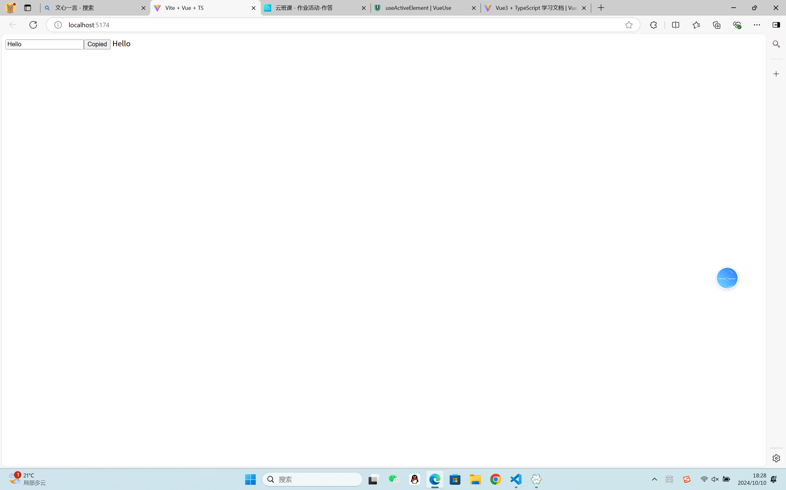

## useClipboard

反应式剪贴板 API。提供响应剪贴板命令（剪切、复制和粘贴）以及异步读取和写入系统剪贴板的功能。对剪贴板内容的访问受 Permissions API 的约束。未经用户许可，不允许读取或更改剪贴板内容。

### 演示



### 用法

```javascript
import { useClipboardItems } from '@vueuse/core'

const mime = 'text/html'
const source = ref([
  new ClipboardItem({
    [mime]: new Blob(['\'<b>HTML content</b>\'', { type: mime }]),
  })
])

const { content, copy, copied, isSupported } = useClipboardItems({ source })
vue 系列
<template>
  <div v-if="isSupported">
    <button @click="copy(source)">
      <!-- by default, `copied` will be reset in 1.5s -->
      <span v-if="!copied">Copy</span>
      <span v-else>Copied!</span>
    </button>
    <p>
      Current copied: <code>{{ text || 'none' }}</code>
    </p>
  </div>
  <p v-else>
    Your browser does not support Clipboard API
  </p>
</template>
```

### 类型声明

```javascript
export interface UseClipboardItemsOptions<Source>
  extends ConfigurableNavigator {
  /**
   * Enabled reading for clipboard
   *
   * @default false
   */
  read?: boolean
  /**
   * Copy source
   */
  source?: Source
  /**
   * Milliseconds to reset state of `copied` ref
   *
   * @default 1500
   */
  copiedDuring?: number
}
export interface UseClipboardItemsReturn<Optional> {
  isSupported: Ref<boolean>
  content: ComputedRef<ClipboardItems>
  copied: ComputedRef<boolean>
  copy: Optional extends true
    ? (content?: ClipboardItems) => Promise<void>
    : (text: ClipboardItems) => Promise<void>
}
/**
 * Reactive Clipboard API.
 *
 * @see https://vueuse.org/useClipboardItems
 * @param options
 */
export declare function useClipboardItems(
  options?: UseClipboardItemsOptions<undefined>,
): UseClipboardItemsReturn<false>
export declare function useClipboardItems(
  options: UseClipboardItemsOptions<MaybeRefOrGetter<ClipboardItems>>,
): UseClipboardItemsReturn<true>
```

### 项目代码

UseClipboard.vue

```javascript
<template>
  <input type="text" v-model="textToCopy" />
  <button @click="copy(textToCopy)">{{ copied ? "Copied" : "Copy" }}</button>
  {{ text }}
</template>

<script setup lang="ts">
import { ref } from "vue";
import { useClipboard } from "@vueuse/core";

const textToCopy = ref("Hello");
const { copy, copied, text } = useClipboard({
  copiedDuring: 3000,
});

useClipboard({
  source: textToCopy,
});
</script>
```
