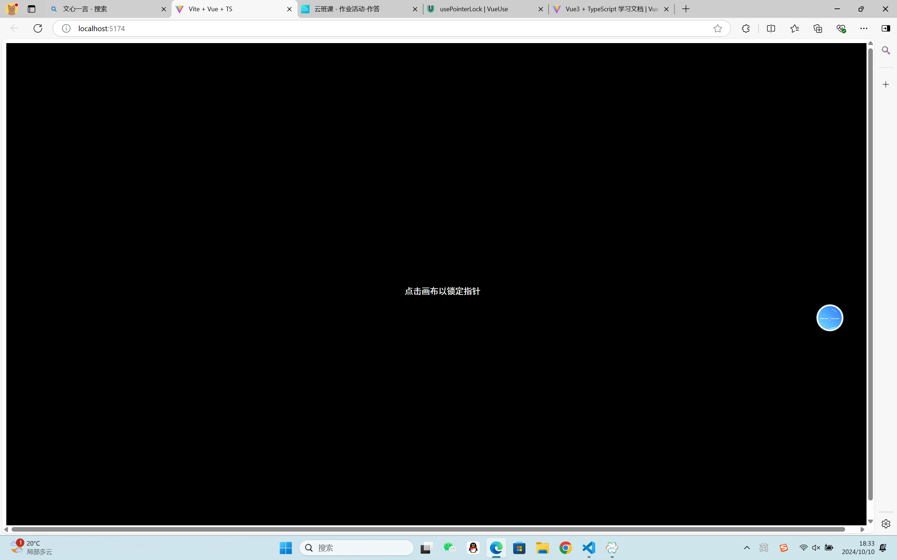
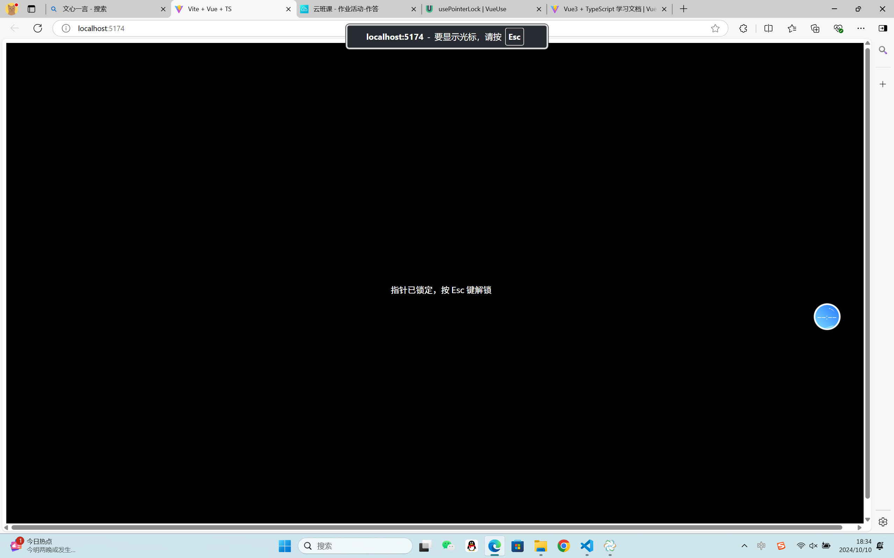

## usePonterLock

反应式指针锁

### 演示




### 用法

```javascript
import { usePointerLock } from "@vueuse/core";

const { isSupported, lock, unlock, element, triggerElement } = usePointerLock();
```

###组件使用

```javascript
<template>
  <UsePointerLock v-slot="{ lock }">
    <canvas />
    <button @click="lock">
      Lock Pointer on Canvas
    </button>
  </UsePointerLock>
</template>
```

### 类型声明

```javascript
type MaybeHTMLElement = HTMLElement | undefined | null
export interface UsePointerLockOptions extends ConfigurableDocument {}
/**
 * Reactive pointer lock.
 *
 * @see https://vueuse.org/usePointerLock
 * @param target
 * @param options
 */
export declare function usePointerLock(
  target?: MaybeElementRef<MaybeHTMLElement>,
  options?: UsePointerLockOptions,
): {
  isSupported: ComputedRef<boolean>
  element: Ref<MaybeHTMLElement, MaybeHTMLElement>
  triggerElement: Ref<MaybeHTMLElement, MaybeHTMLElement>
  lock: (e: MaybeElementRef<MaybeHTMLElement> | Event) => Promise<HTMLElement>
  unlock: () => Promise<boolean>
}
export type UsePointerLockReturn = ReturnType<typeof usePointerLock>
```

### 项目代码

UsePonterLock.vue

```javascript
<template>
  <div
    ref="canvasRef"
    class="pointer-lock-canvas"
    @click="requestPointerLock"
    @contextmenu.prevent
  >
    <!-- 你的内容，比如一个全屏的画布或游戏区域 -->
    <p v-if="!isLocked">点击画布以锁定指针</p>
    <p v-else>指针已锁定，按 Esc 键解锁</p>
  </div>
</template>

<script setup lang="ts">
import { ref, onMounted, onBeforeUnmount } from "vue";

const canvasRef = ref<HTMLDivElement | null>(null);
const isLocked = ref(false);

const requestPointerLock = () => {
  const element = canvasRef.value;
  if (element && !isLocked.value && "pointerLockElement" in document) {
    element.requestPointerLock().catch((error) => {
      console.error("Pointer lock request rejected:", error);
    });
  }
};

const exitPointerLock = () => {
  document.exitPointerLock();
};

// 监听 pointerlockchange 和 pointerlockerror 事件
const handlePointerLockChange = () => {
  isLocked.value = document.pointerLockElement === canvasRef.value;
};

const handlePointerLockError = (event: Event) => {
  console.error("Pointer lock error:", event);
};

onMounted(() => {
  document.addEventListener("pointerlockchange", handlePointerLockChange);
  document.addEventListener("pointerlockerror", handlePointerLockError);

  // 在某些浏览器中，你可能还需要监听 mozpointerlockchange 和 webkitpointerlockchange 等事件
  // 但为了简洁起见，这里只展示了标准事件
});

onBeforeUnmount(() => {
  document.removeEventListener("pointerlockchange", handlePointerLockChange);
  document.removeEventListener("pointerlockerror", handlePointerLockError);

  // 确保在组件卸载时退出指针锁定（如果需要）
  if (isLocked.value) {
    exitPointerLock();
  }
});
</script>

<style scoped>
.pointer-lock-canvas {
  width: 100vw;
  height: 100vh;
  background-color: #000;
  color: #fff;
  display: flex;
  align-items: center;
  justify-content: center;
  cursor: none; /* 在指针锁定时隐藏光标 */
}

.pointer-lock-canvas:focus {
  outline: none; /* 移除焦点时的轮廓线 */
}
</style>
```
