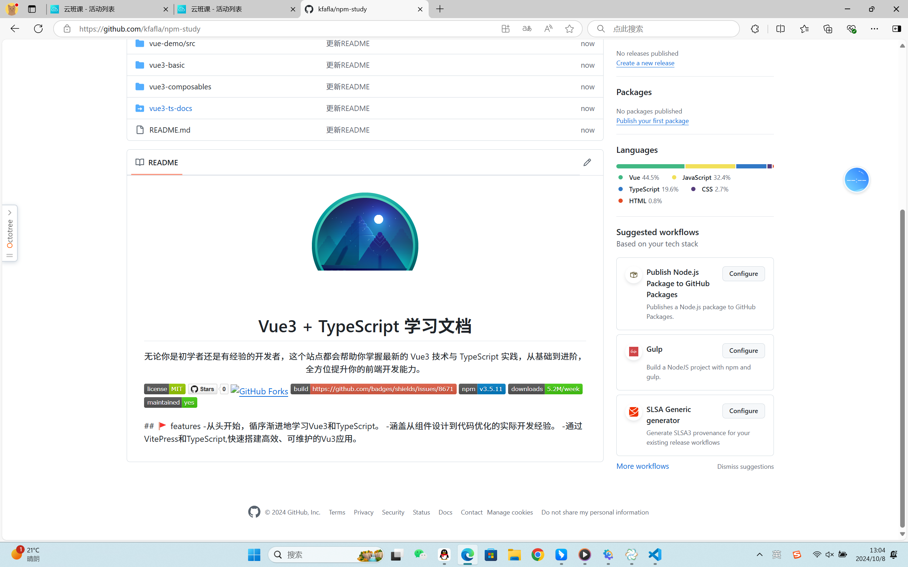
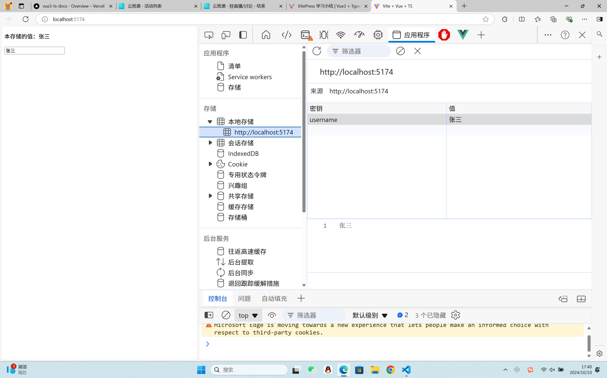
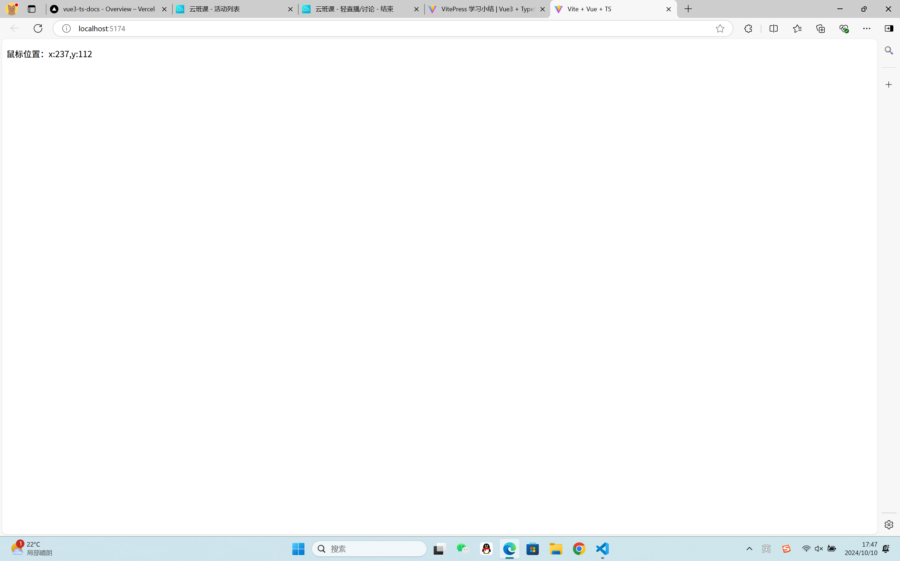
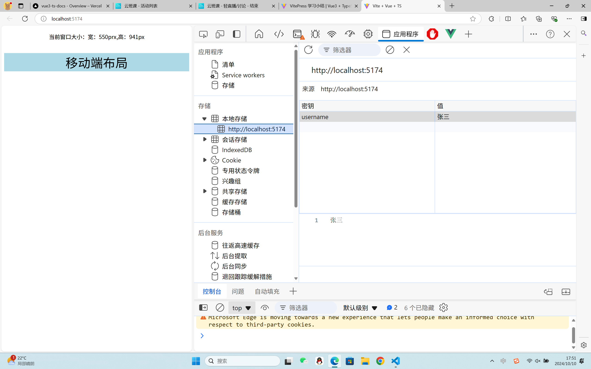
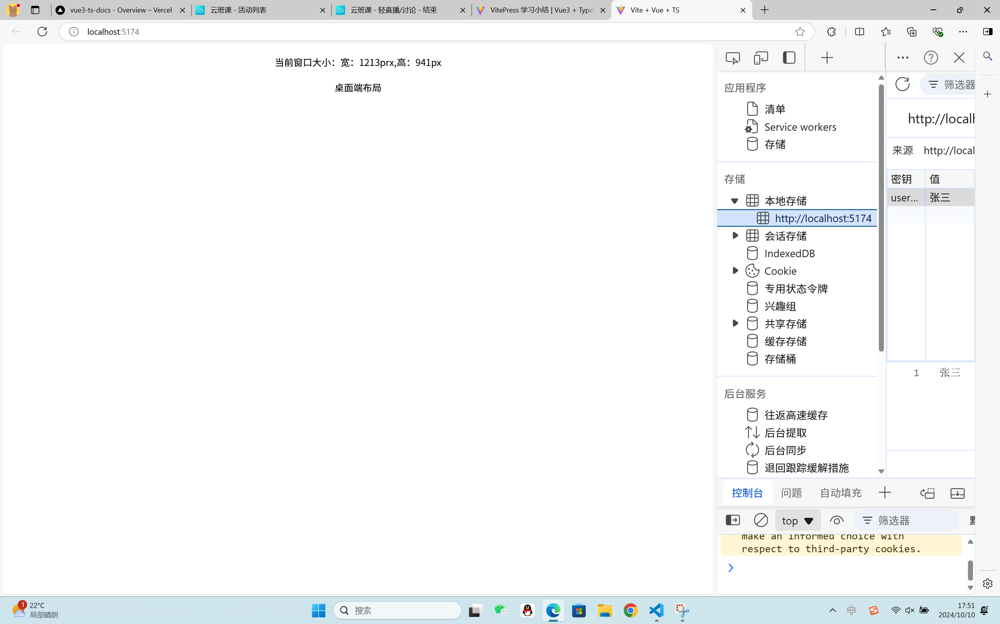
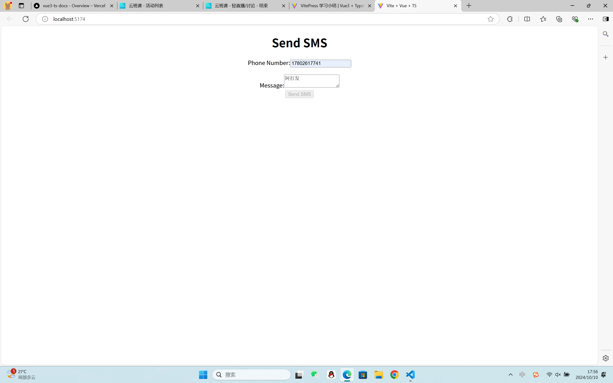
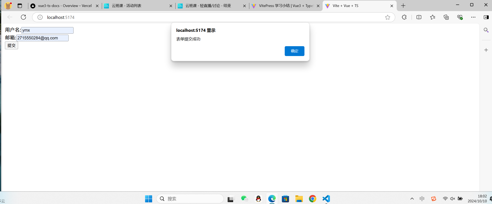

# VitePress 学习小结

## 一、概述

VitePress 是一个基于 Vite 的静态网站生成器，专为项目文档和技术博客设计。它利用 Vue.js 的强大功能，提供了简洁且易于维护的文档结构。通过 VitePress，你可以快速创建一个高性能、美观的文档网站。

## 二、安装与配置

### 1.安装

1. **创建项目目录**：首先，在你的工作区创建一个新的项目目录。
2. **初始化 npm 项目**：在项目目录中运行 `npm init -y` 来初始化一个新的 npm 项目。
3. **安装 VitePress**：运行 `npm install vitepress --save-dev` 来安装 VitePress。

### 2.文件结构

```
.
├─ docs
│  ├─ .vitepress
│  │  └─ config.js
│  ├─ api-examples.md
│  ├─ markdown-examples.md
│  └─ index.md
└─ package.json
```

该目录被视为 VitePress 站点的项目根目录。该目录是 VitePress 的配置文件、开发服务器缓存、构建输出和可选的主题自定义代码的保留位置。

### 3.配置

在项目根目录下创建一个 `.vitepress` 目录，并在其中添加必要的配置文件和目录结构。

- **config.js**：用于配置 VitePress 的全局设置，如站点标题、描述、主题等。
- **theme**（可选）：用于自定义主题。
- **public**：用于存放静态资源，如图片、CSS 文件等。
- **components**（可选）：用于存放自定义 Vue 组件。

示例 `config.js` 配置：

```javascript
module.exports = {
  title: "我的 VitePress 站点",
  description: "一个关于 VitePress 的学习小结。",
  themeConfig: {
    logo: "/logo.png", // 站点 Logo
    nav: [
      // 导航栏链接
      { text: "首页", link: "/" },
      { text: "指南", link: "/guide/" },
    ],
    sidebar: [
      // 侧边栏链接
      {
        text: "介绍",
        link: "/",
      },
      {
        text: "入门",
        items: [
          { text: "安装", link: "/guide/installation" },
          { text: "配置", link: "/guide/configuration" },
        ],
      },
    ],
  },
};
```

## 三、关于Vitepress创建项目

### 1.部署vitepress站点

VitePress 站点位于你的项目目录内。docs

您正在使用默认的构建输出目录 （）。.vitepress/dist

VitePress 作为本地依赖项安装在你的项目中，并且你已经在 ：package.json

```javascript
"scripts": {
    "dev": "vitepress dev docs",
    "build": "vitepress build docs",
    "serve": "vitepress serve docs",
    "docs:dev": "vitepress dev docs",
    "docs:build": "vitepress build docs",
    "docs:preview": "vitepress preview docs"
  },
```

### 2.在本地构建和测试

#### 2.1运行以下命令以构建文档

```javascript
$ npm run docs:build
```

#### 2.2构建完成后，通过运行以下命令在本地预览它：

```javascript
$ npm run docs:preview
```

#### 2.3您可以通过作为参数传递来配置服务器的端口

```javascript
{
  "scripts": {
    "docs:preview": "vitepress preview docs --port 8080"
  }
}
```

#### 2.4使用仪表盘设置新项目并更改这些设置：

```javascript
构建命令： npm run docs:build
输出目录： docs/.vitepress/dist
节点版本：（或更高版本）18
```

## 四.Markdown扩展

### 1.锚点

#### 1.1标题锚点

标头会自动应用锚链接。可以使用 option 配置锚点的渲染。markdown.anchor

#### 1.2自定义锚点

要为标题指定自定义锚点标签，而不是使用自动生成的锚点标签，请向标题添加后缀：

```javascript
# Using custom anchors {#my-anchor}
```

这允许您将标题链接到标题，而不是默认的 .#my-anchor#using-custom-anchors

### 2.链接

#### 2.1内部链接

内部链接将转换为 SPA 导航的路由器链接。此外，每个子目录中包含的 each 都将自动转换为 ，并带有相应的 URL 。index.mdindex.html/

```javascript
.
├─ index.md
├─ foo
│  ├─ index.md
│  ├─ one.md
│  └─ two.md
└─ bar
   ├─ index.md
   ├─ three.md
   └─ four.md
```

#### 2.2外部链接

出站链接会自动获得 ：target="\_blank" rel="noreferrer"

### 3.前言

YAML frontmatter 是开箱即用的：

```javascript
---
title: Blogging Like a Hacker
lang: en-US
---
```

此数据将可供页面的其余部分使用，以及所有自定义和主题组件。

### 4.Github样式的表格

输入

```javascript
| Tables        |      Are      |  Cool |
| ------------- | :-----------: | ----: |
| col 3 is      | right-aligned | $1600 |
| col 2 is      |   centered    |   $12 |
| zebra stripes |   are neat    |    $1 |
```

输出

```javascript
表	是	凉
列 3 是	右对齐	1600 美元
列 2 是	中心	12 美元
斑马条纹	整洁	1 美元
```

### 5.表情符号

例：
输入

```javascript
:tada: :100:
```

输出
🎉 💯

### 6.github代码实例

#### README.md

```javascript
<p align="center">

</p>
<h1 align="center">Vue3 + TypeScript 学习文档</h1>
<p align="center">
无论你是初学者还是有经验的开发者，这个站点都会帮助你掌握最新的 Vue3 技术与 TypeScript 实践，从基础到进阶，全方位提升你的前端开发能力。
</p>

<p>


</p>
## 🚩  features
 -从头开始，循序渐进地学习Vue3和TypeScript。
 -涵盖从组件设计到代码优化的实际开发经验。
 -通过VitePress和TypeScript,快速搭建高效、可维护的Vu3应用。
```

#### LICENSE代码

```javascript
MIT License

Copyright (c) 2024 xmy

Permission is hereby granted, free of charge, to any person obtaining a copy
of this software and associated documentation files (the "Software"), to deal
in the Software without restriction, including without limitation the rights
to use, copy, modify, merge, publish, distribute, sublicense, and/or sell
copies of the Software, and to permit persons to whom the Software is
furnished to do so, subject to the following conditions:

The above copyright notice and this permission notice shall be included in all
copies or substantial portions of the Software.

THE SOFTWARE IS PROVIDED "AS IS", WITHOUT WARRANTY OF ANY KIND, EXPRESS OR
IMPLIED, INCLUDING BUT NOT LIMITED TO THE WARRANTIES OF MERCHANTABILITY,
FITNESS FOR A PARTICULAR PURPOSE AND NONINFRINGEMENT. IN NO EVENT SHALL THE
AUTHORS OR COPYRIGHT HOLDERS BE LIABLE FOR ANY CLAIM, DAMAGES OR OTHER
LIABILITY, WHETHER IN AN ACTION OF CONTRACT, TORT OR OTHERWISE, ARISING FROM,
OUT OF OR IN CONNECTION WITH THE SOFTWARE OR THE USE OR OTHER DEALINGS IN THE
SOFTWARE.
```

### 实例效果



## 五.VitePress项目实践

### 组合函数Composables学习

#### 本地存储的值useLocalStorage

useLocalStorage.ts代码

```javascript
import { ref, watch } from "vue"

export function useLocalStorage(key:string,defaultValue:string){
    const storedValue = localStorage.getItem(key) || defaultValue
    const data = ref<string>(storedValue)

    watch(data,(newValue) =>{
        localStorage.setItem(key,newValue)
    })

    return data
}
```

LocalStorage.vue代码

```javascript
<template>
  <div>
    <p>本存储的值：{{ myData }}</p>
    <input type="text" v-model="myData" placeholder="更新本地存储的值" />
  </div>
</template>

<script setup lang="ts">
import { useLocalStorage } from "../composables/useLocalStorage";

const myData = useLocalStorage("username", "张三");
</script>
```

运行效果图



#### 鼠标

Mouse.vue代码

```javascript
<template>
  <div>
    <p>鼠标位置：x:{{ x }},y:{{ y }}</p>
  </div>
</template>

<script setup lang="ts">
import { useMouse } from "@vueuse/core";

const { x, y } = useMouse();
</script>
```

运行效果图



#### 窗口大小改变

ResizeWindow.vue

```javascript
<template>
  <div>
    <p>当前窗口大小：宽：{{ width }}prx,高：{{ height }}px</p>
    <div :class="{ 'mobile-layout': isMobile }">
      <p>{{ isMobile ? "移动端布局" : "桌面端布局" }}</p>
    </div>
  </div>
</template>

<script setup lang="ts">
import { useWindowSize } from "@vueuse/core";
import { computed } from "vue";

//获取窗口大小
const { width, height } = useWindowSize();
//判断是否为移动端布局(窗子宽度小于768px时)
const isMobile = computed(() => width.value < 768);
</script>
<style>
div {
  text-align: center;
  margin-top: 20px;
}
.mobile-layout {
  background-color: lightblue;
}
.mobile-layout p {
  font-size: 36px;
}

@media (min-width: 768px) {
  .mobile-layout {
    background-color: lightcoral;
  }
  .mobile-layout p {
    font-size: 24px;
  }
}
</style>
```

运行效果图




#### 计时器倒计时

CountdownTimer.vue

```javascript
<template>
  <div>
    <p>Time remaining: {{ formattedTime }}</p>
    <button @click="startCountdown">Start</button>
    <button @click="resetCountdown">Reset</button>
    <button @click="stopCountdown">Stop</button>
  </div>
</template>

<script setup lang="ts">
import { useCountdown } from "../composables/useCountdown"; // 假设 useCountdown.ts 在 composables 文件夹中

// 初始倒计时时间，单位：秒
const initialTime = 60;

// 使用组合式函数 useCountdown
const {
  formattedTime,
  start: startCountdown,
  reset: resetCountdown,
  stop: stopCountdown,
} = useCountdown(initialTime);
</script>

<style scoped>
button {
  margin-right: 5px;
  padding: 10px 20px;
  font-size: 16px;
  cursor: pointer;
  border: none;
  border-radius: 5px;
  transition: background-color 0.3s ease, transform 0.1s ease;
}
button:hover {
  background-color: #007bff; /* 蓝色背景 */
  color: white; /* 白色文字 */
  transform: scale(1.05); /* 轻微放大 */
}

button:active {
  transform: scale(0.95); /* 按下时缩小 */
}

p {
  font-size: 20px;
  margin-bottom: 20px;
  color: #343a40; /* 深灰色文字 */
}
</style>
```

运行效果图


#### 模拟手机短信发送

useSendSMS.ts

```javascript
import { ref, Ref } from 'vue';

interface SendSMSOptions {
  phoneNumber: string;
  message: string;
  onSuccess?: () => void;
  onError?: (error: string) => void;
}

export function useSendSMS() {
  const isSending: Ref<boolean> = ref(false);
  const errorMessage: Ref<string | null> = ref(null);

  const sendSMS = async ({ phoneNumber, message, onSuccess, onError }: SendSMSOptions) => {
    if (!phoneNumber || !message) {
      if (onError) onError('Phone number and message are required.');
      return;
    }

    isSending.value = true;
    errorMessage.value = null;

    // Simulate an API call with a timeout
    try {
      await new Promise((resolve) => setTimeout(resolve, 2000)); // Simulate network delay

      // Simulate successful SMS send
      if (onSuccess) onSuccess();
    } catch (err) {
      // Simulate error handling
      errorMessage.value = 'Failed to send SMS. Please try again later.';
      if (onError) onError(errorMessage.value);
    } finally {
      isSending.value = false;
    }
  };

  return {
    isSending,
    errorMessage,
    sendSMS,
  };
}
```

UseSendSMS.vue

```javascript
<template>
  <div>
    <h1>Send SMS</h1>
    <form @submit.prevent="handleSubmit">
      <div>
        <label for="phoneNumber">Phone Number:</label>
        <input type="text" v-model="phoneNumber" id="phoneNumber" required />
      </div>
      <div>
        <label for="message">Message:</label>
        <textarea v-model="message" id="message" required></textarea>
      </div>
      <button type="submit" :disabled="isSending">Send SMS</button>
    </form>
    <p v-if="errorMessage" class="error">{{ errorMessage }}</p>
  </div>
</template>

<script lang="ts">
import { defineComponent, ref } from "vue";
import { useSendSMS } from "../composables/useSendSMS";

export default defineComponent({
  name: "SendSMSForm",
  setup() {
    const phoneNumber = ref("");
    const message = ref("");
    const { isSending, errorMessage, sendSMS } = useSendSMS();

    const handleSubmit = () => {
      sendSMS({
        phoneNumber: phoneNumber.value,
        message: message.value,
        onSuccess: () => {
          alert("SMS sent successfully!");
          phoneNumber.value = "";
          message.value = "";
        },
        onError: (error) => {
          alert(error);
        },
      });
    };

    return {
      phoneNumber,
      message,
      isSending,
      errorMessage,
      handleSubmit,
    };
  },
});
</script>

<style scoped>
.error {
  color: red;
}
</style>
```

运行效果图


#### 使用Usevue白天黑夜切换

ThemenUsevue.vue

```javascript
<script setup lang="ts">
import { useDark, useToggle } from "@vueuse/core";
const isDark = useDark(); //true or false
const toggleDark = useToggle(isDark);
</script>

<template>
  {{ isDark }}
  <br />
  <!--<button @click="toggleDark">Toggle Dark Mode</button>-->
</template>

<style>
.dark {
  background: black;
  color: white;
}
</style>

```

#### 表单验证

useForm.ts

```javascript
import { ref } from "vue";

// 定义验证规则的类型
type ValidationRule = (value: any) => false | string;
interface ValidationRules {
    [fieldName: string]: ValidationRule[];
}

//  函数接收一个参数 validationRules，该参数是一个对象，包含每个字段的验证规则。
export function useForm ( validationRules: ValidationRules ){

    // fields: 存储每个表单字段当前的值。
    // errors: 存储每个字段的错误信息。
    // isValid: 表示整个表单是否有效，初始为 true。
    const fields = ref<Record<string,string>>({});
    const errors = ref<Record<string,string>>({});
    const isValid = ref(true);

    // 遍历 validationRules 中的字段名，初始化每个字段的值（为空字符串）和错误信息（也为空字符串）。确保在调用验证时每个字段都有一个默认状态。
    for (const fieldName of Object.keys(validationRules)) {
        fields.value[fieldName] = '';
        errors.value[fieldName] = '';
    }

    // validateField 函数负责验证特定字段。
    // 获取当前字段的值，并存储相关规则。
    const validateField = (fieldName: string) => {
        const value = fields.value[fieldName];
        const rules = validationRules[fieldName];
        errors.value[fieldName] = '';

        // 遍历与字段相关的所有验证规则。执行规则并检查是否返回错误信息；如有错误，更新错误状态并停止进一步检查（使用 break）。
        for (const rule of rules) {
            const errorMessage = rule(value);
            if (errorMessage) {
              errors.value[fieldName] = errorMessage;
              break; // 一旦找到错误，结束规则验证
            }
        }
    };

    // validateForm 函数验证所有字段。
    // 重置 isValid 为 true，然后对每个字段调用 validateField。
    // 如果某个字段有错误，更新 isValid 为 false，最终返回表单验证的整体结果。
    const validateForm = () => {
        isValid.value = true;
        for (const fieldName of Object.keys(validationRules)) {
            validateField(fieldName);
            if (errors.value[fieldName]) {
            isValid.value = false;
            }
        }
        return isValid.value;
    };

    // updateField 函数用于更新特定字段的值，并在每次更新时立即验证那个字段。这使得用户的输入始终保持实时反馈。
    const updateField = (fieldName: string, value: string) => {
        fields.value[fieldName] = value;
        validateField(fieldName); // 每次更新时重新验证该字段
    };

    return {
        fields,
        errors,
        isValid,
        validateForm,
        updateField,
    };

}
```

UseForm.vue

```javascript
<template>
  <!-- 使用了 Vue 的事件修饰符 .prevent，阻止表单的默认提交行为，允许开发者手动处理提交逻辑。 -->
  <form @submit.prevent="handleSubmit">
    <!-- v-model 实现双向数据绑定，将输入字段的值与 fields.username 绑定。
      在 @input 事件中调用 updateField 方法，实时更新字段值并验证。
      当错误信息存在时，展示相应的错误信息。  -->
    <div>
      <label for="username">用户名:</label>
      <input
        id="username"
        v-model="fields.username"
        @input="updateField('username', fields.username)"
      />
      <span v-if="errors.username">{{ errors.username }}</span>
    </div>

    <div>
      <label for="email">邮箱:</label>
      <input
        id="email"
        v-model="fields.email"
        @input="updateField('email', fields.email)"
      />
      <span v-if="errors.email">{{ errors.email }}</span>
    </div>

    <button type="submit">提交</button>
  </form>
</template>

<script setup lang="ts">
import { useForm } from "../composables/useForm";

// 定义验证规则  为每个输入字段定义了一个数组，包含多个验证函数，当函数返回错误信息时，会显式显示。
const validationRules = {
  username: [
    (value: string) => !value && "用户名是必填的",
    (value: string) => value.length < 3 && "用户名至少要3个字符",
  ],
  email: [
    (value: string) => !value && "邮箱是必填的",
    (value: string) => !/\S+@\S+\.\S+/.test(value) && "邮箱格式不正确",
  ],
};

// 使用组合函数
const { fields, errors, validateForm, updateField } = useForm(validationRules);

const handleSubmit = () => {
  if (validateForm()) {
    // 表单验证通过，可以进行提交操作
    alert("表单提交成功");
  } else {
    // 表单验证失败，显示错误消息
    alert("请检查表单中的错误");
  }
};
</script>

<style scoped></style>

```

运行效果图

