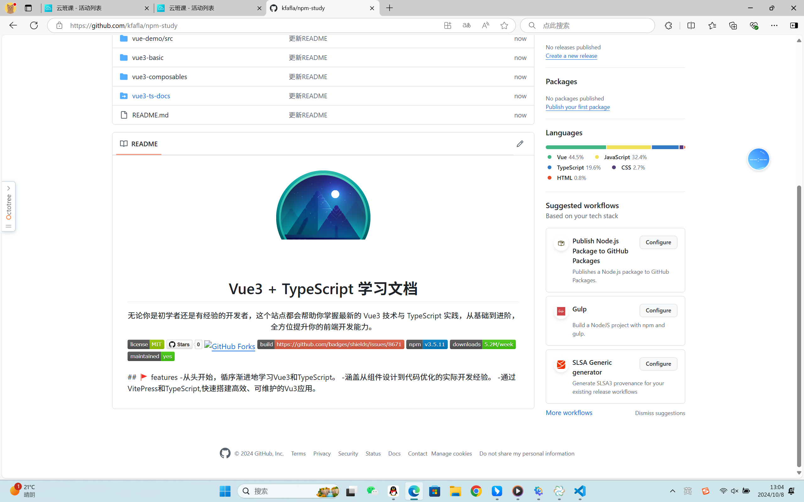

# 编写标准的README

## README.md代码

```javascript
<p align="center">

</p>
<h1 align="center">Vue3 + TypeScript 学习文档</h1>
<p align="center">
无论你是初学者还是有经验的开发者，这个站点都会帮助你掌握最新的 Vue3 技术与 TypeScript 实践，从基础到进阶，全方位提升你的前端开发能力。
</p>

<p>


</p>
## 🚩  features
 -从头开始，循序渐进地学习Vue3和TypeScript。
 -涵盖从组件设计到代码优化的实际开发经验。
 -通过VitePress和TypeScript,快速搭建高效、可维护的Vu3应用。
```

## LICENSE代码

```javascript
MIT License

Copyright (c) 2024 xmy

Permission is hereby granted, free of charge, to any person obtaining a copy
of this software and associated documentation files (the "Software"), to deal
in the Software without restriction, including without limitation the rights
to use, copy, modify, merge, publish, distribute, sublicense, and/or sell
copies of the Software, and to permit persons to whom the Software is
furnished to do so, subject to the following conditions:

The above copyright notice and this permission notice shall be included in all
copies or substantial portions of the Software.

THE SOFTWARE IS PROVIDED "AS IS", WITHOUT WARRANTY OF ANY KIND, EXPRESS OR
IMPLIED, INCLUDING BUT NOT LIMITED TO THE WARRANTIES OF MERCHANTABILITY,
FITNESS FOR A PARTICULAR PURPOSE AND NONINFRINGEMENT. IN NO EVENT SHALL THE
AUTHORS OR COPYRIGHT HOLDERS BE LIABLE FOR ANY CLAIM, DAMAGES OR OTHER
LIABILITY, WHETHER IN AN ACTION OF CONTRACT, TORT OR OTHERWISE, ARISING FROM,
OUT OF OR IN CONNECTION WITH THE SOFTWARE OR THE USE OR OTHER DEALINGS IN THE
SOFTWARE.
```

## 实例效果



# 组合式函数Composables学习
